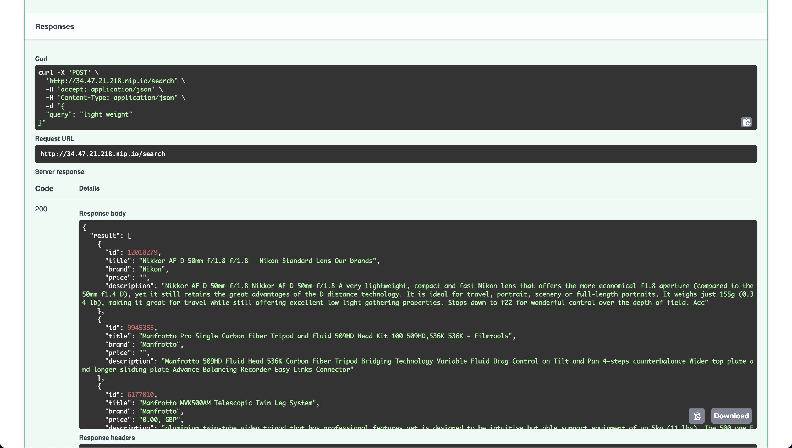
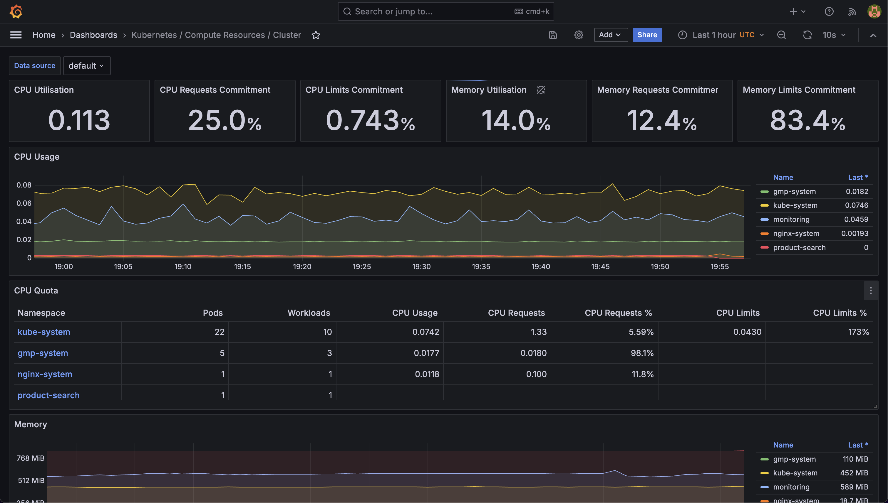

# Product Search

### API



### Prometheus and Grafana Monitoring



## Setup

## Spin up compute instance

Create a new GCP project

Create an instance

```shell
cd iac/ansible/jenkins
ansible-playbook create_compute_intance.yaml
```
Update the instance IP address in iac/ansible/jenkins/inventory

Create a container with jenkins an k8s ready

```shell
ansible-playbook -i ../inventory deploy_jenkins.yaml
```
*Note:* If encounter 'unreachable' error, run

```shell
sskh-keygen -R <host address>
ansible-playbook -i ../inventory deploy_jenkins.yaml
```

ssh to the instance to get the jenkins password

```shell
ssh -i <path_to_private_key> <username>@<external_ip>

# get the running container id
sudo docker ps

# get the password
sudo docker logs <container_id>
```

Access the jenkins container at port 8081

Copy and paste the password to log into jenkins

```shell
exit
```

## Set up Jenkins

Install **Docker**, **Docker Pipeline**, and **Kubernetes** plugins:
`Dashboard` > `Manage Jenkins` > `Plugins` > `Available Plugins` > `Docker` & `Kubernetes`.

Restart Jenkins upon finishing installation. If the container shutdowns, ssh to the vm and restart the container.

*Optional:* Set unlimited API calls:
`Dashboard` > `Manage Jenkins` > `System` > `Github API usage` > `Never check rate limit` > `Save`

Add webhook in Github repo: `http://<jenkins host address>:<port>/git-webhook/`

Add new item for the project. Add credentials for Github and Dockerhub at `Dashboard` > `Credentials`


## Spin up GKE cluster

```shell
cd ../../terraform
terraform init
terraform plan
terraform apply
```
Connect to the new cluster with `gcloud`

Switch to the new cluster
```
kubectx
kubectx <cluster>
```
```shell
cd ../../helm/nginx-ingress
kubectl create ns nginx-system
kubens nginx-system
helm upgrade --install nginx-ingress .

cd ../app_chart_nginx_ingress
kubectl create ns product-search
kubens product-search
helm upgrade --install app .
```
Copy and paste `address`.nip.io to *helm/app_chart_nginx_ingress/nginx-ingress.yaml* `spec.host`

Run
```shell
helm upgrade --install app .
```
App Swagger UI can be accessed at `address`.nip.io/docs

### Connect Jenkins to GKE cluster

```shell
kubens product-search
kubectl create clusterrolebinding product-search-admin-binding \
  --clusterrole=admin \
  --serviceaccount=product-search:default \
  --namespace=product-search

kubectl create clusterrolebinding anonymous-admin-binding \
  --clusterrole=admin \
  --user=system:anonymous \
  --namespace=product-search
```

`Dashboard` > `Manage Jenkins` > `Clouds` > `New cloud`
Add the GKE cluster name at `Cloud name`. Select `Kubernetes`
Get the certificate and URL of the cluster via this command:
```shell
cat ~/.kube/config
```
Click on test connection

## Monitoring

```shell
cd ../monitoring
```
Follow README.md in the directory
