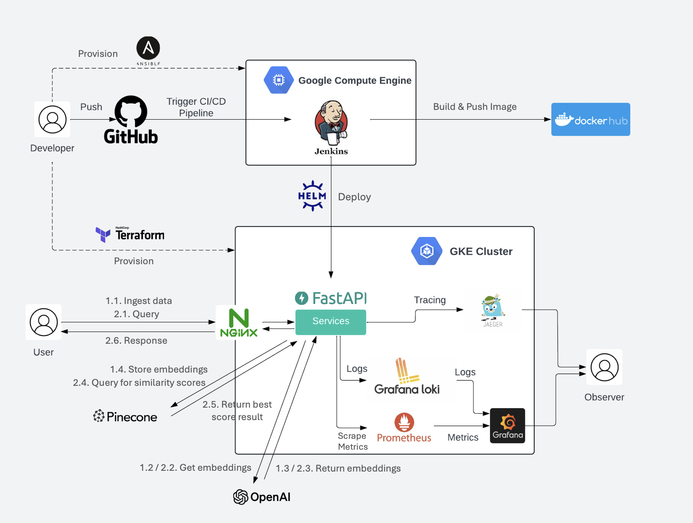
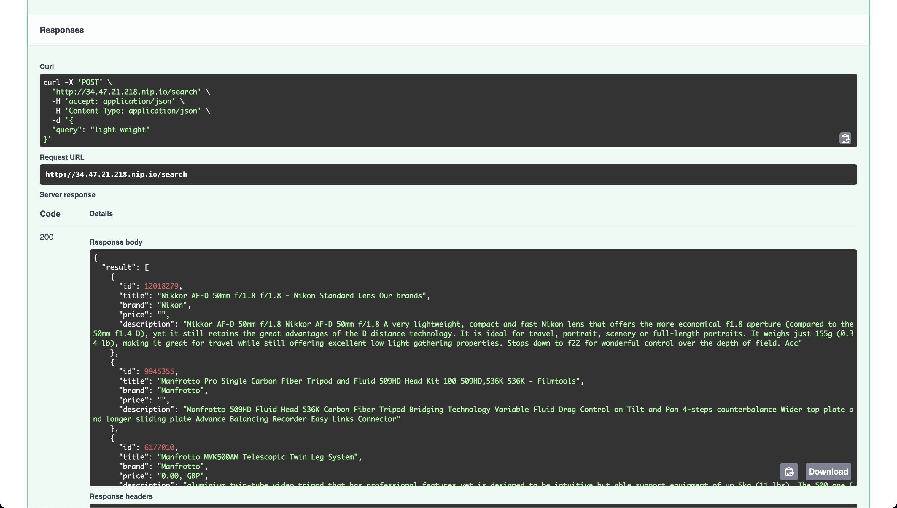
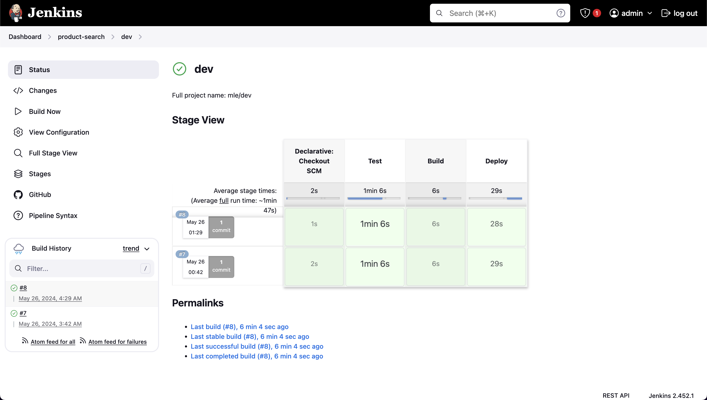
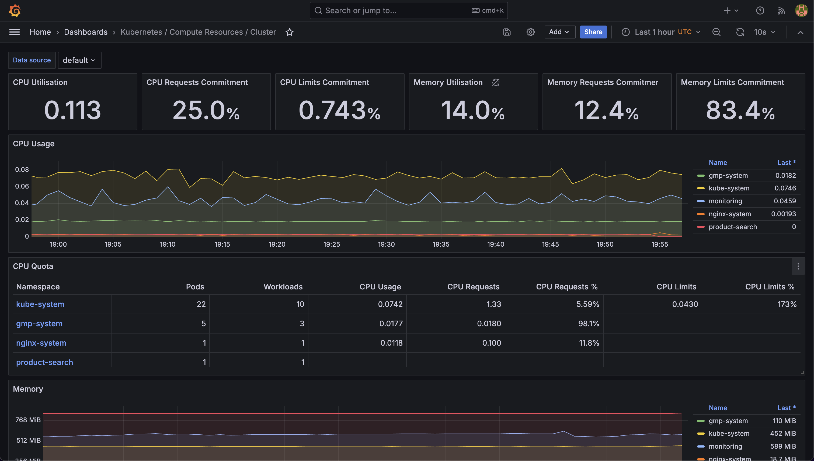
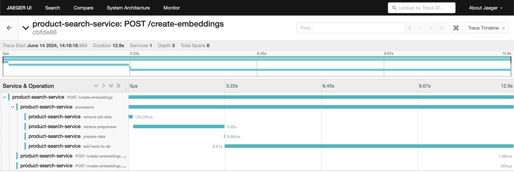
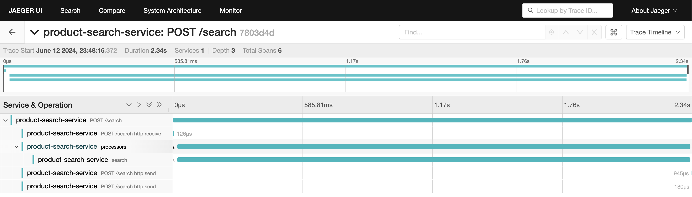
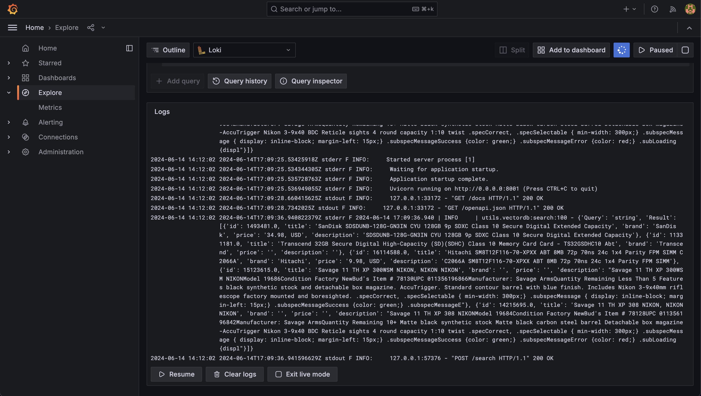
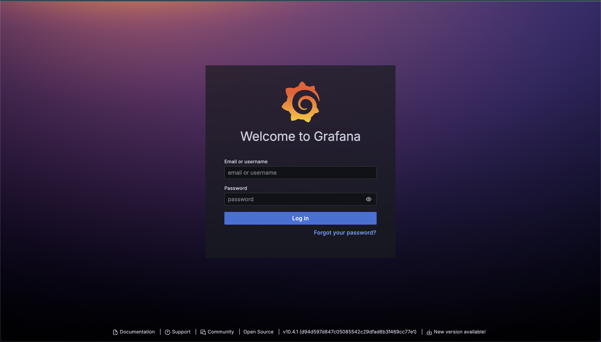
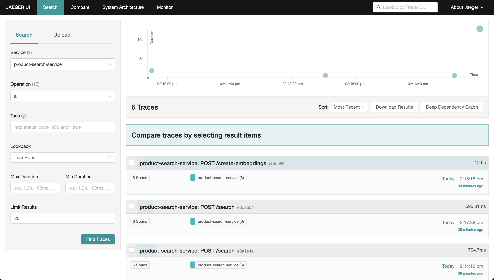

# Product Search App - API, Monitoring, MLOPs

### Architecture



### API - Swagger UI



### Jenkins



### Metrics Monitoring with Prometheus and Grafana



### Jaeger Tracing




### Loggings with Loki and Grafana




## Setup

1. [Set up dev environment](#1-set-up-dev-evironment)

2. [Spin up a compute instance](#2-spin-up-a-compute-instance)

3. [Set up Jenkins](#3-set-up-jenkins)

4. [Spin up a GKE cluster](#4-spin-up-a-gke-cluster)

5. [Monitoring](#5-monitoring)

    5.1. [Logs & Metrics Monitoring with Loki, Prometheus & Grafana](#51-logs--metrics-monitoring-with-loki-prometheus--grafana)

    5.2. [Tracing with Jaeger](#52-tracing-with-jaeger)


## 1. Set up dev evironment

Python: 3.10

Install the neccessary packages, including Ansible and google auth:

```shell
pip install requirements-dev.txt
```
Install [Terraform ](https://developer.hashicorp.com/terraform/tutorials/aws-get-started/install-cli)

Install [Helm](https://helm.sh/docs/intro/install/)

_Optional:_
Install [**kubectx** and **kubens**](https://github.com/ahmetb/kubectx.git)


## 2. Spin up a compute instance

Create a new GCP project

Create an instance

```shell
cd iac/ansible/jenkins
ansible-playbook create_compute_instance.yaml
```

Update the instance IP address in iac/ansible/jenkins/inventory

Create a container with jenkins an k8s ready

```shell
ansible-playbook -i ../inventory deploy_jenkins.yaml
```

_Note:_ If encounter 'unreachable' error, run

```shell
ssh-keygen -R <host address>
ansible-playbook -i ../inventory deploy_jenkins.yaml
```

ssh to the instance to get the jenkins password

```shell
ssh -i <path_to_private_key> <username>@<external_ip>

# get the running container id
sudo docker ps

# get the password
sudo docker logs <container_id>
```

Access the jenkins container at port 8081

Copy and paste the password to log into jenkins. Username is _admin_  

To exit the container:

```shell
exit
```

## 3. Set up Jenkins

Install **Docker**, **Docker Pipeline**, and **Kubernetes** plugins:
`Dashboard` > `Manage Jenkins` > `Plugins` > `Available Plugins` > `Docker`, `Docker Pipeline` & `Kubernetes`.

Restart Jenkins upon finishing installation. If the container shutdowns, ssh to the vm and restart the container.

_Optional:_ Set unlimited API calls:
`Dashboard` > `Manage Jenkins` > `System` > `Github API usage` > `Never check rate limit` > `Save`

Add webhook in Github repo: `http://<jenkins host address>:<port>/git-webhook/`

Add a new _multibranch pipeline_ item for the project.

Add credentials for Github and Dockerhub at `Dashboard` > `Credentials` > `Add credentials` > `Username with password`

Add api keys at `Dashboard` > `Credentials` > `Add credentials` > `Sceret text`

## 4. Spin up a GKE cluster

**Note**: The _gke-cluster/_ directory was cloned from a [repo](https://github.com/hashicorp/learn-terraform-provision-gke-cluster.git) of Hashicorp.

```shell
cd iac/terraform/gke-cluster
terraform init
terraform plan
terraform apply
```

Connect to the new cluster with `gcloud`

```shell
gcloud container clusters get-credentials <cluster name> --region <region> --project <project>
```

Switch to the new cluster

```
kubectx
kubectx <cluster>
```

```shell
cd helm/nginx-ingress
kubectl create ns nginx-system
kubens nginx-system
helm upgrade --install nginx-ingress .

cd ../app_chart_nginx_ingress
kubectl create ns product-search
```

_Optional:_
```shell
kubens product-search
helm upgrade --install app --set openai_api_key="<openai api key>" --set pinecone_api_key="<pinecone api key>" .
```

Copy and paste `address`.nip.io to _helm/app_chart_nginx_ingress/nginx-ingress.yaml_ `spec.host`

```shell
helm upgrade --install app --set openai_api_key="<openai api key>" --set pinecone_api_key="<pinecone api key>" .
```

App Swagger UI can be accessed at `address`.nip.io/docs

### Connect Jenkins to GKE cluster

```shell
kubens product-search
kubectl create clusterrolebinding product-search-admin-binding \
  --clusterrole=admin \
  --serviceaccount=product-search:default \
  --namespace=product-search

kubectl create clusterrolebinding anonymous-admin-binding \
  --clusterrole=admin \
  --user=system:anonymous \
  --namespace=product-search
```

`Dashboard` > `Manage Jenkins` > `Clouds` > `New cloud`  
Add the GKE cluster name at `Cloud name`. Select `Kubernetes`.  
Get the certificate and URL of the cluster via this command:

```shell
cat ~/.kube/config
```

Input _product-search_ at `namespace`.  
Click on test connection button to confirm successful connection.

## 5. Monitoring

```shell
kubectl create ns monitoring
kubens monitoring
```

### 5.1. Logs & Metrics Monitoring with Loki, Prometheus & Grafana

_Source:_  
_[grafana helm charts](https://github.com/grafana/helm-charts/)_  
_[prometheus helm charts](https://github.com/prometheus-community/helm-charts/)_  

_Chart links:_  
_[kube-prometheus-stack](https://github.com/grafana/helm-charts/releases/download/loki-stack-2.10.2/loki-stack-2.10.2.tgz)_  
_[loki-stack](https://github.com/prometheus-community/helm-charts/releases/download/kube-prometheus-stack-60.1.0/kube-prometheus-stack-60.1.0.tgz)_

```shell
cd monitoring/logs-metrics/helm-charts
helm upgrade --install logsmetrics .
```

Expose ports to access prometheus and grafana dashboards

```shell
kubectl port-forward svc/logsmetrics-grafana 3000:80
```



_Username:_ **admin**  
_Password:_ **prom-operator**

### 5.2. Tracing with Jaeger

```shell
cd monitoring/jaeger-tracing/helm-charts
helm upgrade --install jaeger .
```

Expose ports to access jaeger UI

```shell
kubectl port-forward svc/jaeger 16686:16686
```


