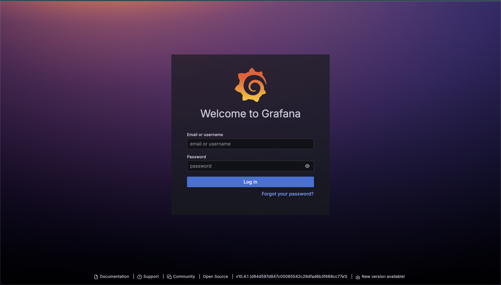

## Kubernetes System Mornitoring

Add the **prometheus-community** repo

```shell
helm repo add prometheus-community https://prometheus-community.github.io/helm-charts
helm repo update
```

Create a new namespace and install *prometheus-community/kube-prometheus-stack*
```
k create ns monitoring
kubens monitoring
helm install monitoring-stack prometheus-community/kube-prometheus-stack
```

Expose ports to access prometheus and grafana dashboards
```
kubectl port-forward svc/monitoring-stack-kube-prom-prometheus 9090:9090
kubectl port-forward svc/monitoring-stack-grafana 8888:80
```



*Username:* **admin**
*Password:* **prom-operator**
